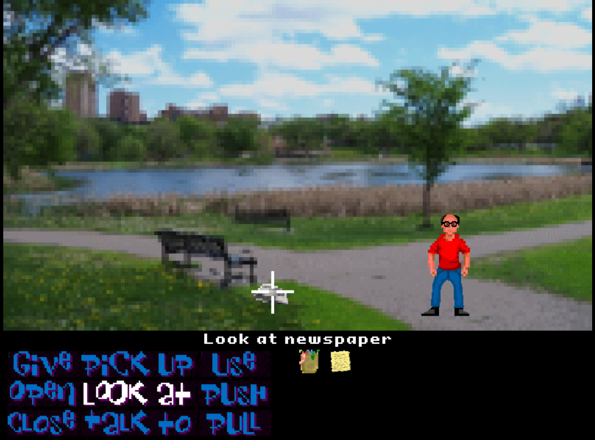

# Game-a-Tron 4000™

The [Azure Bot Service](https://docs.microsoft.com/en-us/azure/bot-service/?view=azure-bot-service-4.0) and [Bot Builder SDK](https://github.com/Microsoft/BotBuilder) help you create intelligent bots to naturally interact with your users over various channels, such as websites, Cortana and Skype. But you can create even more interesting scenarios!

Being big fans of both bots and classic 8-bit point-and-click adventure games, we wanted to see if we could build such a game using the [Azure Bot Service](https://docs.microsoft.com/en-us/azure/bot-service/?view=azure-bot-service-4.0) and [Bot Builder SDK](https://github.com/Microsoft/BotBuilder). After all, the mechanics of classic adventure games are very much like interacting with a bot. This is especially true for the earlier text-based adventure games. The result is the Game-a-Tron 4000™ game engine which uses various Bot Builder 
features in combination with an HTML5 client to recreate the look and feel of the golden-era adventure games such as Monkey Island, Day of the Tentacle, etc.

## Playing the game

The sample game can be played at: https://playgameatron4000.azurewebsites.net/Play?game=ReturnOfTheBodySnatchers

If you want to run the game yourself, make sure that the following tools are installed:

- [Node.js (v8.5 or greater)](https://nodejs.org/)
- [.NET Core SDK version 2.1.403 or higher](https://www.microsoft.com/net/download)
- [Visual Studio Code](https://code.visualstudio.com/download) (including the C# plug-in)
- [Bot Framework Emulator](https://github.com/Microsoft/BotFramework-Emulator)

The game can be played in text adventure mode by using the [Bot Framework Emulator](https://github.com/Microsoft/BotFramework-Emulator). Follow the [text mode instructions](./docs/textmode.md) to get started.

For the full experience, play the game in a browser in point & click adventure mode. The Game-a-Tron 4000™ graphical user interface uses a Direct Line channel to connect to the bot. To get a Direct Line channel the bot needs to be registered with the [Azure Bot Service](https://azure.microsoft.com/en-us/services/bot-service/). This is just a registration to make use of the provided channels, the bot code itself can still run on your local machine (which makes debugging easy). Follow the [point & click mode instructions](./docs/pointclickmode.md) to set up the registration.

## Workshop

If you're reading this while attending our workshop, great! Please see the [workshop instructions](./docs/workshop.md) to get started.