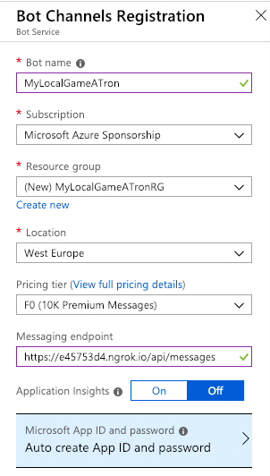
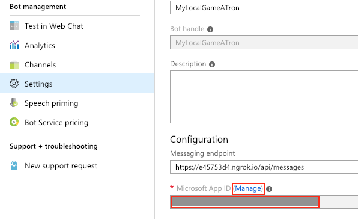
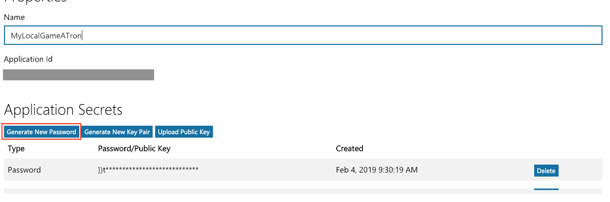
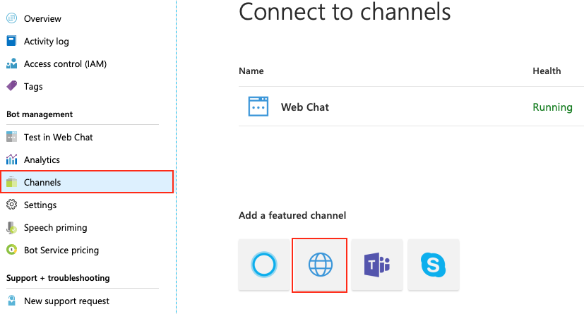
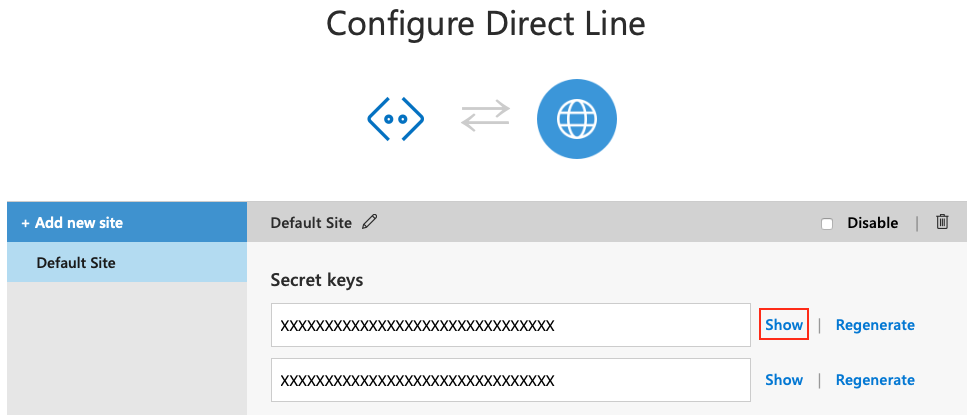

# Run the game in point & click adventure mode

The Game-a-Tron 4000™ graphical game interface uses a Direct Line channel to connect to the bot. To get a Direct Line channel the bot needs to be registered with the Azure Bot Service. This is just a registration to make use of the provided channels, the bot code itself can run anywhere you want. We'll run it on your local machine, which also makes it really easy to debug.

## Install and run ngrok

In this step you'll use **ngrok** to expose your local machine (which may be behind NATs and firewalls) to the public internet over a secure tunnel. This enables the Azure Bot Service on the web to forward messages directly to your machine.

1. Download **ngrok** from https://ngrok.com/download.

2. From the command line, run the following command:

	```
	ngrok http -host-header=rewrite 5000
	```

3. When **ngrok** starts, it will display the public forwarding HTTPS URL. You’ll need to copy and save it for later, as highlighted below:

    

## Register the Game-a-Tron 4000™ bot with the Azure Bot Service

You need a **Bot Channels Registration** bot service to be able to use Bot Service functionality. A registration bot lets you connect the Game-a-Tron 4000™ bot to the Direct Line channel required by the graphical game interface.


To create a **Bot Channels Registration**, do the following:

1. Click the **New** button found on the upper left-hand corner of the Azure portal, then select **AI + Cognitive Services > Bot Channels Registration**.

2. A new blade will open with information about the **Bot Channels Registration**. Click the **Create** button to start the creation process.

3. In the **Bot Service** blade, provide the requested information about your bot as shown in the image below. Your bot name must be unique. Also note that the value for **Messaging endpoint** is the **ngrok** HTTPS forwarding URL post-fixed with */api/messages*. 

    

4. Click **Create** to create the service and register your bot's messaging endpoint.

Confirm that the registration has been created by checking the **Notifications**. The notifications will change from *Deployment in progress...* to *Deployment succeeded*. Click **Go to resource** button to open the bot's resources blade.

## Bot Channels Registration password

**Bot Channels Registration** bot service does not have an app service associated with it. Because of that, this bot service only has a *MicrosoftAppID*. You need to generate the password manually and save it yourself. You will need this password when you run the bot.

To generate a MicrosoftAppPassword, do the following:

1. From the **Settings** blade, and note the Microsoft App ID. You will need this value later on. Click the **Manage** link appearing next to the Microsoft App ID. This link will open a window where you can generate a new password. 

    

2. Click **Generate New Password**. This will generate a new password for your bot. Copy this password and save it to a file. This is the only time you will see this password. If you do not have the full password saved, you will need to repeat the process to create a new password when you need it later. 

    

## Add a Direct Line channel

The graphical game interface can communicate with the Game-a-Tron 4000™ bot using a Direct Line channel.

1. To add the Direct Line channel, select the **Channels** blade, and then click **Direct Line**.

    

2. When the channel is created, the Bot Framework generates secret keys that you the graphical game interface can use to authenticate the Direct Line API requests that it issues to communicate with the bot. To view a key in plain text, click Show for the corresponding key.

    

    Copy and securely store the key that is shown.

## Create a .bot file with connection settings

A .bot file acts as the place to bring all service references together to enable tooling. Game-a-Tron 4000™ uses the .bot file to load service configuration information such as the Azure Bot Service registration, Microsoft App ID and password, and the Direct Line secret.

1. In Visual Studio Code, create a new `GameATron4000.Development.bot` file in the `/src` folder (if the file already exists, you can overwrite it).

2. Paste the following code snippet in the .bot file and replace the placeholders with the actual values for your bot registration.

    ```
    {
    "name": "GameATron4000",
    "description": "",
    "services": [
        {
        "type": "endpoint",
        "name": "GameATron4000",
        "endpoint": "<Messaging endpoint>",
        "appId": "<Microsoft App ID>",
        "appPassword": "<Microsoft password>",
        "id": "1"
        },
        {
        "type": "generic",
        "name": "DirectLine",
        "url": "nourl",
        "configuration": {
            "secret": "<Direct Line key>"
        },
        "id": "2"
        },
        {
        "type": "abs",
        "name": "bot",
        "serviceName": "<Bot name>",
        "id": "3"
        }
    ],
    "padlock": "",
    "version": "2.0"
    }
    ```

    |Placeholder        |Description
    |-                  |-
    |Messaging endpoint | **ngrok** HTTPS forwarding URL postfixed with */api/messages*. Can also be found on the **Settings** blade of the **Bot Channels Registration** (in this walkthrough, we've used *https://e45753d4.ngrok.io/api/messages*).
    |Microsoft App ID   | ID of the Microsoft App, can be found on the **Settings** blade of the **Bot Channels Registration**.
    |Microsoft password | The password you generated for the Microsoft App.
    |Direct Line key    | The secret key for the Direct Line channel.
    |Bot name           | Bot handle used for the bot registration (in this walkthrough, we've used *MyLocalGameATron*). Can also be found on the **Settings** blade of the **Bot Channels Registration**.

## Run the game in the browser

1. In Visual Studio Code, select **Debug | Start Debugging**.

2. In a browser window, navigate to *http://localhost:5000/*.

    The game GUI will now load. If you open your browser's developer tools you can view the interaction between the bot and the browser in the console log.