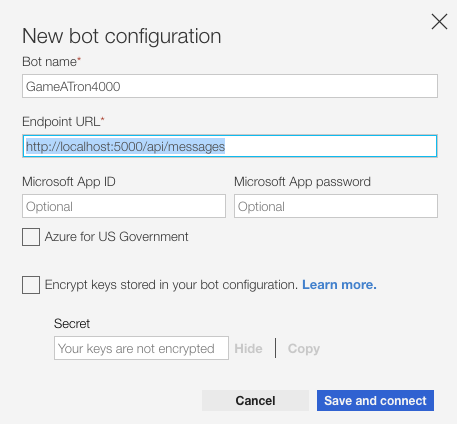
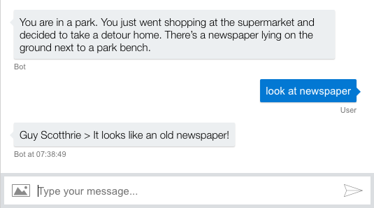
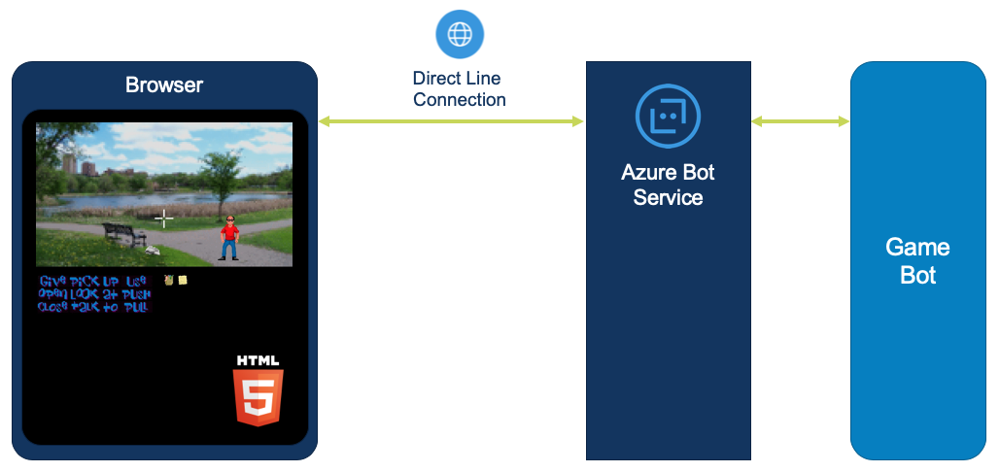
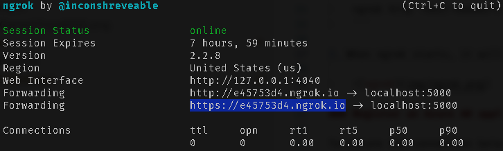
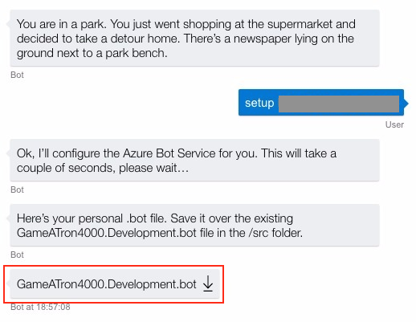

# Trial 1: Run Game-a-Tron 4000™ on your local machine

In this module you'll learn how to use the emulator to test a bot. You will also learn how you can connect the Azure Bot Service to a bot running on your local machine.

## Run the game in text adventure mode

The game can be played in text adventure by using the Bot Framework emulator.

1. Open the `GameATron4000.code-workspace` workspace in Visual Studio Code.

2. In Visual Studio Code, select **Debug | Start Debugging**.

3. Start the Bot Framework Emulator.

4. Select **File | New Bot Configuration...**.

6. On the **New bot configuration** dialog, enter *GameATron4000* as the bot name and *http://localhost:5000/api/messages* as the endpoint URL. Leave all other fields blank.

    

7. Click **Save and connect**, name your bot file *GameATron4000.Development.bot* and save it in the project's `/src` folder.

8. The emulator will connect to the bot. You can now enter messages like *look at newspaper* to play the game.

    

9. When you're done playing, select **Debug | Stop Debugging** in Visual Studio Code.


## Run the game in point & click adventure mode

There are two ways to run the game in point & click adventure:

1. If you've got access to an Azure subscription, you can follow the instructions [here](./pointclickmode.md) to set up the required resources in Azure yourself (which is interesting if you've never worked with Azure Bot Service before).

2. If you don't have access to an Azure subscription, no worries! We've prepared some **Bot Channels Registration** resources in Azure to get you started quickly. Even if you're using the pre-created resources, it's still beneficial to look through the [custom instructions](./pointclickmode.md) to get a better understanding of how things work. Follow the instructions below to get started with the pre-created Azure resources.

You need a **Bot Channels Registration** bot service to be able to use Bot Service functionality. The Bot Service allows the graphical game interface running in the browser to communicate with the Game-a-Tron 4000™ bot using a Direct Line channel.



### Install and run ngrok

In this step you'll use **ngrok** to expose your local machine (which may be behind NATs and firewalls) to the public internet over a secure tunnel. This enables the Azure Bot Service on the web to forward messages directly to your machine.

1. Download **ngrok** from https://ngrok.com/download.

2. From the command line, run the following command:

	```
	ngrok http -host-header=rewrite 5000
	```

3. When **ngrok** starts, it will display the public forwarding HTTPS URL. You’ll need to copy and save it for later, as highlighted below:

    

### Let the Game-a-Tron 4000™ bot configure the Bot Channels Registration for you

The bot supports a special `setup` command that you can use to automatically configure a **Bot Channels Registration** for the workshop.

1. Return to Visual Studio Code and select **Debug | Start Debugging** to start the bot if it's not running anymore.

2. Switch to the Bot Framework Emulator and select **Restart conversation**. The emulator will connect to the bot and you can play the game again, just like before.

3. Let the bot configure your personal **Bot Channels Registration** resource by giving it the following command:

    ```
    setup <Event code> <Attendee code> <Messaging endpoint>
    ```

    At the start of the workshop, you should have received the *event* and *attendee* codes. If not, please ask one of the organizers.

    For the *messaging endpoint*, use the public forwarding HTTPS URL from **ngrok** (e.g. *https://e45753d4.ngrok.io*).

4. The bot will now set up your pre-created **Bot Channels Registration** with your custom messaging endpoint. When it's done it will present you with a `GameATron4000.Development.bot` file containing all the settings the bot requires to connect to the Azure Bot Service.

    

    Save the .bot file in the `/src` folder, overwriting the existing `GameATron4000.Development.bot` file.

### Run the game

1. In Visual Studio Code, stop and restart the debugger to let the bot use the new settings.

2. In a browser window, navigate to *http://localhost:5000/*.

    The game GUI will now load. If you open your browser's developer tools you can view the interaction between the bot and the browser in the console log.