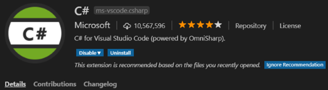

# Workshop

Welcome to the Game-a-Tron 4000™ workshop!

Please ensure that the following tools are installed on your machine:

- [Node.js (v8.5 or greater)](https://nodejs.org/)
- [.NET Core SDK version 2.1.403 or higher](https://www.microsoft.com/net/download)
- [Visual Studio Code](https://code.visualstudio.com/download)
- [Latest version of the Azure CLI.](https://docs.microsoft.com/en-us/cli/azure/install-azure-cli?view=azure-cli-latest)
- [The MSBot command-line tool](https://github.com/Microsoft/botbuilder-tools/tree/master/packages/MSBot)
- [Bot Framework Emulator](https://github.com/Microsoft/BotFramework-Emulator)

After installing Visual Studio Code, start it and install the C# plugin:

## The Three Trials

In good adventure game tradition, we've prepared three trials for you to explore:

1. [Run Game-a-Tron 4000™ on your local machine](./workshop-trial1.md)

2. [Add text translation middleware](./workshop-trial2.md)

3. [Add natural language support](./workshop-trial3.md)

> TIP: If you need to execute a command-line command during the workshop, make sure you don't execute them in PowerShell. For some commands, PowerShell trips over the escaping in the snippet.